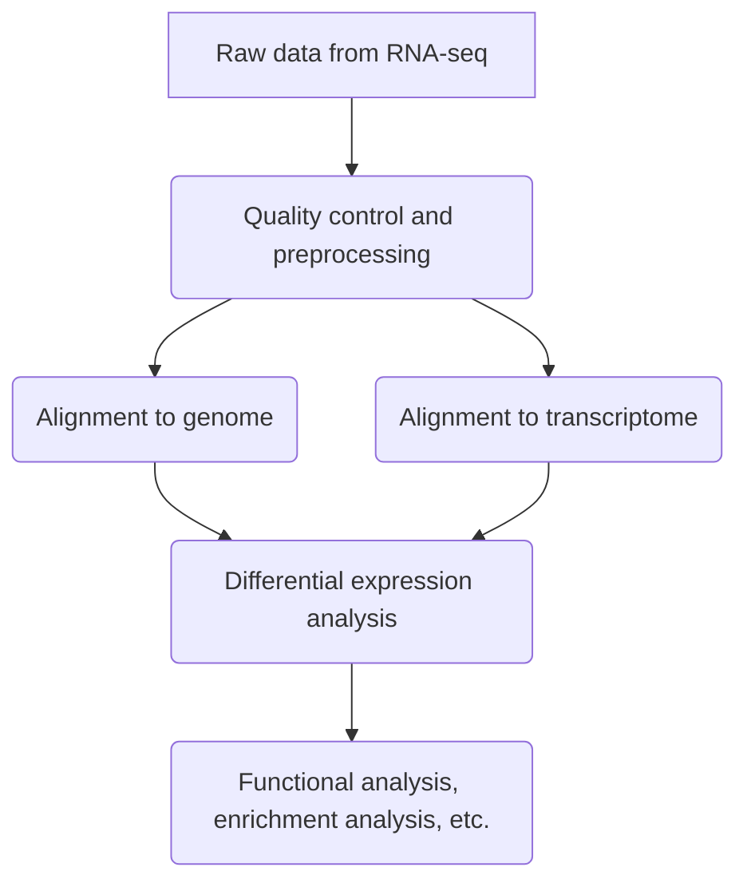

###### Started on Monday, May 17th, 2021 by Luigui Gallardo-Becerra (bfllg77@gmail.com)

## Introduction to differential expression analysis

Differential expression (DE) analysis is used to answer the question: what are the genomic features (genes, transcripts or exons) that are expressed significantly different between groups of samples? To accomplish this, we need to quantify the differences between the RNA-seq data for each sample and group. 

For example, in the next picture we want to compare two conditions (A and B), for the genes 1 and 2; each condition has 3 replicates marked in different colors. We could see that there are a DE between conditions: Condition A has more reads for the gene 1, while Condition B has more reads for the gene 2. The DE does not imply that there is no expression of one or more genes at all in one condition or another, but rather that it exists in a differential proportion considering similar depth sequence.


## Pipeline overview

To know what are the DE genomic features, we must to follow a pipeline like the one in the figure below. As we saw before, the fundamental step is the quantification of the RNA-seq data, but first we should include previous steps to control the quality of our data. Subsequently, we must align our reads against the genome (if available) or the transcriptome (could be 'de novo' assembled with the same reads). Finally, we have the DE analysis and after we could do functional analysis, enrichment analysis, etc.



### Example

For this tutorial we will work with six samples: three for the control group and three for the question group. This is its metadata:

|group|sample|R1|R2|
|-|-|-|-|
|dextrose|D1|D1_R1.fastq.gz|D1_R2.fastq.gz|
|dextrose|D2|D2_R1.fastq.gz|D2_R2.fastq.gz|
|dextrose|D3|D3_R1.fastq.gz|D3_R2.fastq.gz|
|impranil|I1|I1_R1.fastq.gz|I1_R2.fastq.gz|
|impranil|I2|I2_R1.fastq.gz|I2_R2.fastq.gz|
|impranil|I3|I3_R1.fastq.gz|I3_R2.fastq.gz|

### Calculate expression with RSEM

In this example we are going to align our RNA-seq data against the reference genome using RSEM, but this method could be used against a transcriptome too. This algorithm allows to handle reads that map to multiple genes or isoforms, a common challenge in RNA-seq data.

```bash
rsem-calculate-expression --star --star-gzipped-read-file --append-names -p 60 --paired-end D1_1.fastq.gz D1_2.fastq.gz genoma_A3I1_rsem D1_rsem

rsem-calculate-expression --star --star-gzipped-read-file --append-names -p 60 --paired-end D2_1.fastq.gz D2_2.fastq.gz genoma_A3I1_rsem D2_rsem

rsem-calculate-expression --star --star-gzipped-read-file --append-names -p 60 --paired-end D3_1.fastq.gz D3_2.fastq.gz genoma_A3I1_rsem D3_rsem

rsem-calculate-expression --star --star-gzipped-read-file --append-names -p 60 --paired-end I1_1.fastq.gz I1_2.fastq.gz genoma_A3I1_rsem I1_rsem

rsem-calculate-expression --star --star-gzipped-read-file --append-names -p 60 --paired-end I2_1.fastq.gz I2_2.fastq.gz genoma_A3I1_rsem I2_rsem

rsem-calculate-expression --star --star-gzipped-read-file --append-names -p 60 --paired-end I3_1.fastq.gz I3_2.fastq.gz genoma_A3I1_rsem I3_rsem
```

This is an example of the output:

| transcript_id | gene_id    | length | effective_length | expected_count | TPM   | FPKM  | IsoPct |
| ------------- | ---------- | ------ | ---------------- | -------------- | ----- | ----- | ------ |
| gene_00001.t1 | gene_00001 | 1053   | 856.86           | 52             | 9.77  | 10.88 | 100    |
| gene_00002.t1 | gene_00002 | 2455   | 2258.86          | 9              | 0.64  | 0.71  | 100    |
| gene_00003.t1 | gene_00003 | 2349   | 2152.86          | 351            | 26.24 | 29.24 | 100    |
| gene_00004.t1 | gene_00004 | 2002   | 1805.86          | 332            | 29.59 | 32.97 | 100    |
| gene_00005.t1 | gene_00005 | 1506   | 1309.86          | 2              | 0.25  | 0.27  | 100    |
| gene_00006.t1 | gene_00006 | 1053   | 856.86           | 0              | 0     | 0     | 0      |
| gene_00007.t1 | gene_00007 | 3840   | 3643.86          | 1              | 0.04  | 0.05  | 100    |
| gene_00008.t1 | gene_00008 | 2751   | 2554.86          | 5              | 0.31  | 0.35  | 100    |
| gene_00009.t1 | gene_00009 | 480    | 283.91           | 1              | 0.57  | 0.63  | 100    |

### Differential expression with DESeq2

There a many algorithms used to make DE analysis, one of the most used is DESeq2. We could use the R package, to install it we run this inside R:

```R
#### Instalation of BiocManager, DESeq2, apeglm
#### Run only once in your computer
if (!requireNamespace("BiocManager", quietly = TRUE))
    install.packages("BiocManager")
BiocManager::install("DESeq2")
BiocManager::install("apeglm")

#### Optional libraries to generate graphs: instalation of ggplot2, pheatmap and RColorBrewer
#### Run only once in your computer
install.packages("ggplot2")
install.packages("pheatmap")
install.packages("RColorBrewer")

#### Load libraries
library(DESeq2)
library(apeglm)

#### Load optional libraries
library(ggplot2)
library(pheatmap)
library(RColorBrewer)
```

After, we import the counting matrix (generated with RSEM) and the metadata file with the sample-group correspondence. This is the header of our RSEM.genes.counts.matrix:

|            | D1_rsem | D2_rsem | D3_rsem | I1_rsem | I2_rsem | I3_rsem |
| ---------- | ------- | ------- | ------- | ------- | ------- | ------- |
| gene_09063 | 174     | 131     | 147     | 10      | 9       | 12      |
| gene_12878 | 32      | 44      | 37      | 18      | 20      | 22      |
| gene_12066 | 11      | 9       | 6       | 1       | 1       | 0       |
| gene_12117 | 68      | 80      | 73      | 27      | 29      | 17      |
| gene_00424 | 662     | 658     | 1033    | 473     | 493     | 438     |
| gene_06101 | 70      | 65      | 80      | 11      | 9       | 8       |
| gene_08260 | 518     | 590     | 615     | 180     | 178     | 211     |
| gene_06056 | 23      | 17      | 26      | 9       | 6       | 2       |
| gene_06489 | 37      | 33      | 31      | 369     | 353     | 365     |

And our metadata.txt:

||group|
|-|-|
|dextrosa_rep1|dextrosa|
|dextrosa_rep2|dextrosa|
|dextrosa_rep3|dextrosa|
|impranil_rep1|impranil|
|impranil_rep2|impranil|
|impranil_rep3|impranil|

Now, inside of R we run the code below to enter our example data:

```R
rsem_count <- as.matrix(read.delim(file = "RSEM.gene.counts.matrix",
    sep="\t",
    row.names = 1))

column_data <- read.csv(file = "metadata.txt",
    sep = "\t")

deseq_data_set <- DESeqDataSetFromMatrix(countData = rsem_count,
    colData = column_data,
    design = ~group)

deseq_data_set$group <- relevel(deseq_data_set$group,
    ref = "dextrosa")
```

As a recommendation, we should remove the low abundance transcripts:

```R
keep <- rowSums(counts(deseq_data_set)) >= 10

deseq_data_set <- deseq_data_set[keep,]
```

With the filtered matrix, we could start with the DE analysis:

```R
dif_expression_deseq_data_set <- DESeq(deseq_data_set)

res_dif_expression_deseq_data_set <- results(dif_expression_deseq_data_set)

summary_dif_expression_deseq_data_set <- summary(res_dif_expression_deseq_data_set)
```

We could filter the results, like the p-value and log2 fold change:

```R
res05_dif_expression_deseq_data_set <- results(dif_expression_deseq_data_set,
    alpha=0.05)

summary_dif_expression_deseq_data_set <- summary(res05_dif_expression_deseq_data_set)
```

Finally, to export the final table we run:

```R
write.table(as.data.frame(res05_dif_expression_deseq_data_set),sep = '\t' ,
    file="results.tsv")
```

### Graphs

After we obtain the final matrix from DESeq2, we can generate several graphs. For example, to generate a Volcano plot we could run this:

```R
png("volcano_plot.png")

plotMA(res05_dif_expression_deseq_data_set,
    ylim=c(-10,10))

dev.off()
```


To generate an individual plot (only one feature) we run:

```R
png("TRINITY_DN1097_c0_g1.png")

plotCounts(dif_expression_deseq_data_set,
    gene= "TRINITY_DN1097_c0_g1",
    intgroup="group")

dev.off()
```


We could generate a heatmap with a selection of the transcripts. In the example below we obtain the first 20 transcripts and plot them in a heatmap:

```R
select <- order(rowMeans(counts(dif_expression_deseq_data_set,normalized=TRUE)),
    decreasing=TRUE)[1:20]

df <- as.data.frame(colData(dif_expression_deseq_data_set)[,c("X","group")])

png("heatmap.png")

pheatmap(assay(dif_expression_deseq_data_set)[select,],
    cluster_rows=FALSE,
    show_rownames=FALSE,
    cluster_cols=FALSE,
    annotation_col=df)

dev.off()
```


To generate a PCA, we run:

```R
vsd <- vst(dif_expression_deseq_data_set, blind=FALSE)

png("PCA.png")

plotPCA(vsd, intgroup=c("group"))

dev.off()
```

